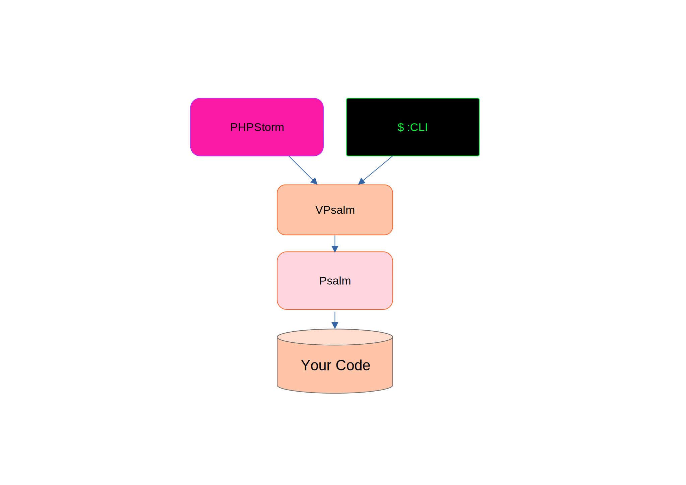
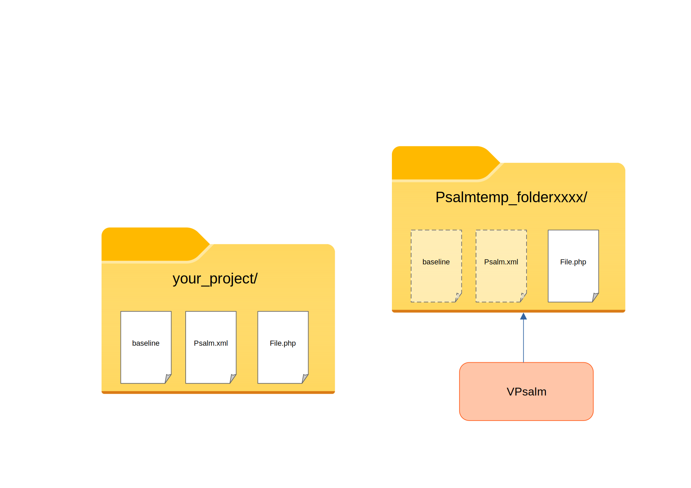

# VPsalm

A script for psalm managing the following features :

 - Psalm baseline in PHPStorm : PHPStorm's Psalm plugin uses temporary files which makes the baseline feature inemployable. This script does the necessary manipulations to correct this.
 - Managing phpVersion : According to the `composer.json`, VPsalm will call psalm on limit cases and reserve a special treatment for the warnings raised on a single version.
 - Dynamic Baseline management : VPsalm create a baseline for each php file analyzed (while analyzed alone) so that you won't be notified by legacy code.

## Prerequisite

This script is designed as an interface between [psalm](https://psalm.dev/) and [phpstorm](https://www.jetbrains.com/phpstorm/) so you need now about both of these to use this script.

## Installation

1. Load the current repo where you can find it easily.

2. Install psalm in this repo using the following command :
```
composer require vimeo/psalm
```

3. Write a psalm config file (`psalm.xml`) in the project you want to analyse. You can either call
```
path/to/vpsalm/vendor/bin/psalm --init
```
or write it yourself using [psalm documentation](https://psalm.dev/docs/running_psalm/configuration/).

4. copy `vpsalm-config.php` from vpsalm to your project and edit the files path so they match those of your project.

5. In PHPStorm, link the Psalm plugin to vpsalm : in [File | Settings | PHP | Quality Tools](jetbrains://PhpStorm/settings?name=PHP--Quality+Tools) click the `...` next to psalm configuration. There, point psalm path toward `absolute/path/to/vpsalm/vpsalm.bat`. If you click validate on the right psalm version appear at the bottom of the window.

6. Change your inspection profile to show psalm inspections.

## Usage

You may use vpsalm in one of the following way : 

- As PHPStorm inspection : Once the last two installation steps are done it should work automaticaly. When you will open a php file for the first time using vpsalm a baseline file will be generated for this file and phpstorm wil only report the error "clean code, congratulations !" (attesting vpsalm ran properly). If you write dirty code afterward, vpsalm will warn you about the new errors. To reset a baseline just delete the according baseline file and open the php file again with phpstorm.
- Using CLI : you can call vpsalm using the following CLI command :
```
path/to/vpsalm/vpsalm.bat <psalm arguments>
```
You just have to respect the following constraints :
  - Call it from the root of your project.
  - If you want to analyze a single file put it at the end of your CLI call.
  - If you want to analyze several files register them in your psalm.xml config file (it may have a different name) and make sure the last CLI argument is not a php file.

||
|:--:|
|*Abstraction of how VPsalm works*|
  
## Behavior

When you call vpsalm it will follow the following pattern : 

1. Check your project's php versions from composer.json. VPsalm will analysed each version mentionned in the phpVersion
2. Check if a baseline already exists for the called file/folder. If not, create one using the first parsed phpversion.
3. Call Psalm for each php version.
4. Sort the warnings raised by psalm and add a tag in front to identify on which php version the error occurs : 
    |Tag            |Meaning                                                                  |
    |:-:            |:-:                                                                      |
    |\<phpVersion\>:|The warning was found only in psalm analysis for the precised php version|
    |:              |The warning was raised on several psalm analysis                         |
  If an error is found by several psalm calls and a vpsalm-ignore file exists then the error will be ignored if it's type appear in vpsalm-ignore (deprecated feature).
  At the end of the sort if no warning has been reported the warning "Clean code, Congratulations !" will be returned. This is useful for testing but in practice it may be better to remove this behavior so that a clean code would not raise warnings at all.

When PHPStorm calls Vpsalm, it first create a temp folder called Psalmtemp_folderxxxx/ in which it copies the analysed file. It then call vpsalm (psalm supposedly) with the temp file as CLI argument. Vpsalm will copy and adapt the config file and the baseline to this new environment so that it simulates your project.
||
|:--:|
|*abstraction of how PHPStorm call VPaslm*|

## TO DO

 - Adapt other psalm feature (Autoloader for examle)
 - Linux/IOS compatibility
 - Use parallel psalm call to improve performances
